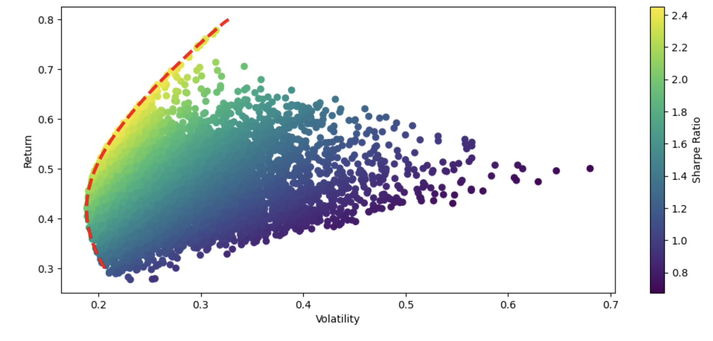

# Portfolio Optimisation & Risk Analysis

This project implements a **portfolio optimisation framework** using Python, applied to real stock data
(specifically stocks held in my personal portfolio: Apple, IBM, ARM, Rolls-Royce between 2023–2024).
It explores how risk and return interact in investment portfolios.

## Key Features
- Imported stock price data via `yfinance`.
- Calculated **log returns**, covariance matrix, and volatility.
- Ran a **Monte Carlo simulation** of 6,000 random portfolios.
- Computed **Sharpe Ratios** to evaluate performance.
- Plotted the **efficient frontier** and identified minimum-variance portfolios.

## Tools
Python, NumPy, Pandas, Matplotlib, SciPy, yFinance

## Results
- Identified optimal portfolio weights to maximise Sharpe Ratio.
- Visualised the efficient frontier and portfolio risk-return trade-offs.

